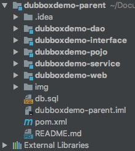
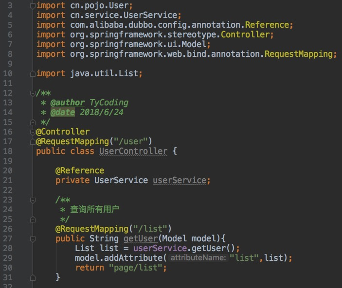
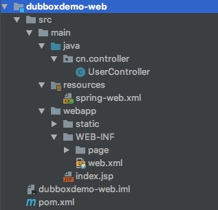
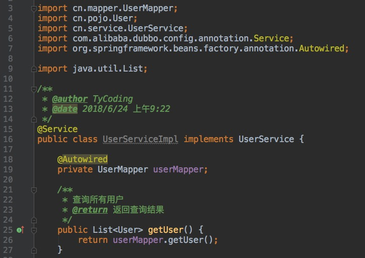
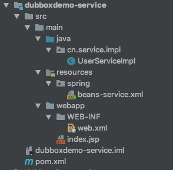
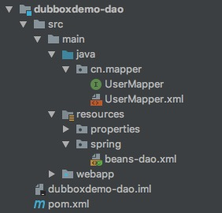
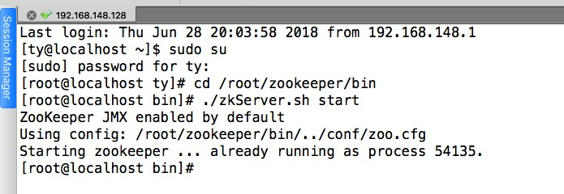
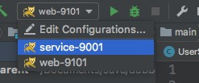
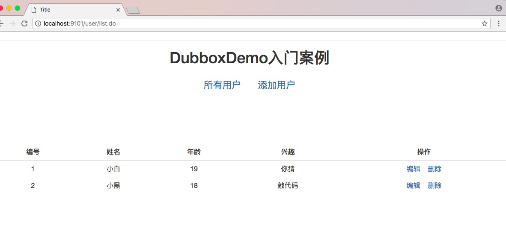

**一个案例快速入门Dubbox开发**

在之前的 [Dubbox的入门配置](http://tycoding.cn/2018/06/20/Dubbox/) 一文中我们了解如何部署注册中心`zookeeper`。那么接下来我们就该实战快速入门`Dubbox`框架开发。其实，我们这里实现的maven多模块项目无非就是讲各个`package`都拆分成一个个单独的项目，然后各个小项目之间通过依赖关系进行联系。`parent`模块负责管理所有的`jar`。而提供者的业务就需要暴露给注册中心；当消费者调用的时候就随机提供一个提供者地址给消费者。
这里我还要强调一点，`dubbo`在阿里停止维护后，由当当网继续维护，并命名为`dubbox`，而其并没有上传到maven中央仓库，所以我们使用maven中央仓库提供的jar包时不行的，可以用我提供的`2.8.4`版本的。

<!--more-->

**DubboxDemo项目导航帖**

1. [Dubbox入门配置](tycoding.cn/2018/06/20/Dubbox/)

2. [Dubbox入门之环境搭建](tycoding.cn/2018/06/24/DubboxDemo-ready/)

   

**项目注意细节之处**

1. `dubbox-xx.jar`，特别要要注意，我这里提供了一个版本的jar：`dubbo2.8.4.jar`传送门： [百度云](https://pan.baidu.com/s/17l9Bmlxz7vnni96T3rq0LQ)  密码：k8qs。
2. 注意配置各个模块之间的依赖关系。
3. 运行项目首先运行`service`模块，然后再运行`web`模块。且注意两者的Tomcat的端口号不能相同。
4. 运行项目之前首先需要在SecureCRT中打开服务器的`zookeeper`注册中心。

**项目测试环境**

JDK1.8|Tomcat8|maven|IDEA

-|:-:|-:


**项目目录结构**



# pom配置

## 解释

1. 这里不再贴pom的相关依赖，详细内容请查看GitHub上的源码。
2. 注意`parent`父项目中的`pom.xml`中定义的是jar依赖的相关版本，并不是写入进`parent`中`pom`的依赖都会被使用，只有子模块调用了，才会使用相应的依赖。

## 注意

1. 注意`dubbo-xx.jar`不能使用maven仓库中的依赖，可以选择使用我提供版本的jar。
2. 除了上面说的框架提供的相关依赖，我们还需要配置模块间的依赖关系。
3. 配置模块间的依赖关系除了idea的`Module Setting`，还需要手动添加`pom`坐标。
4. `Module Setting`的依赖配置遵循调用那个模块就配置哪个模块，`pom`坐标遵循常见的三层架构设计。

# 服务端配置

## Tomcat

1. 需要注意的就是端口号，部署到服务器上的项目（模块—）必须占用的端口号不同，而在idea中除了有`HTTP port`、还有`JMX port`，这两个端口配置都不能重复出现。
2. 启动项目（模块）时，先启动`service`生产者，再启动`web`消费者。

## zookeeper

1. `zookeeper`称为注册中心，所以启动`service`模块前首先要启动`zookeeper`。启动方式就是进入`bin`目录中输入`./zkServer.sh start`。
2. 需要在`service`以及`web`模块对应的spring配置文件中注册`dubbo`，并且配置连接`zookeeper`的地址。、

# Spring环境配置

## 介绍

Spring的配置其实一共有三个部分：

* `spring-service`
* `spring-dao`
* `springmvc`

分别对应的模块

* `service`模块
* `dao`模块
* `web`模块

**注意** 我们知道配置了`spring.xml`，就需要在`web.xml`中加载这些配置文件，因为我们已经建立了各个模块之间的依赖关系，所以，我们仅需要在`dao`或`service`模块任意一个的`web.xml`中使用通配符的方式加载配置文件即可。

## 代码编写

`beans-dao.xml`

```xml
<?xml version="1.0" encoding="UTF-8"?>
<beans xmlns="http://www.springframework.org/schema/beans"
       xmlns:context="http://www.springframework.org/schema/context"
       xmlns:xsi="http://www.w3.org/2001/XMLSchema-instance"
       xsi:schemaLocation="http://www.springframework.org/schema/beans
	http://www.springframework.org/schema/beans/spring-beans-4.2.xsd
	http://www.springframework.org/schema/context
	http://www.springframework.org/schema/context/spring-context.xsd">

    <!-- 数据库连接池 -->
    <!-- 加载配置文件 -->
    <context:property-placeholder location="classpath:properties/db.properties"/>

    <!-- 数据库连接池 -->
    <bean id="dataSource" class="com.alibaba.druid.pool.DruidDataSource" destroy-method="close">
        <property name="url" value="${jdbc.url}"/>
        <property name="username" value="${jdbc.username}"/>
        <property name="password" value="${jdbc.password}"/>
        <property name="driverClassName" value="${jdbc.driver}"/>
        <property name="maxActive" value="10"/>
        <property name="minIdle" value="5"/>
    </bean>

    <!-- 让spring管理sqlsessionfactory 使用mybatis和spring整合包中的 -->
    <bean id="sqlSessionFactory" class="org.mybatis.spring.SqlSessionFactoryBean">
        <!-- 数据库连接池 -->
        <property name="dataSource" ref="dataSource"/>
    </bean>
    <bean class="org.mybatis.spring.mapper.MapperScannerConfigurer">
        <property name="basePackage" value="cn.mapper"/>
    </bean>
</beans>
```

`beans-service.xml`

```xml
<?xml version="1.0" encoding="UTF-8"?>
<beans xmlns="http://www.springframework.org/schema/beans"
       xmlns:xsi="http://www.w3.org/2001/XMLSchema-instance"
       xmlns:dubbo="http://code.alibabatech.com/schema/dubbo"
       xsi:schemaLocation="http://www.springframework.org/schema/beans
	http://www.springframework.org/schema/beans/spring-beans.xsd
        http://code.alibabatech.com/schema/dubbo
        http://code.alibabatech.com/schema/dubbo/dubbo.xsd">
	<!-- 用dubbo协议在20881端口暴露服务 -->
    <dubbo:protocol name="dubbo" port="20881"/>
	<!-- 当前应用的名称(是注册中心识别的名称) -->
    <dubbo:application name="dubboxdemo-service"/>
    <!-- 注册中心地址(zookeeper) -->
    <dubbo:registry address="zookeeper://192.168.148.128:2181"/>
    <!-- 配置dubbo的包扫描 -->
    <dubbo:annotation package="cn.service.impl"/>
</beans>
```

这里我们需要注意的就是注册中心地址一定要填写正确，首先你需要**打开服务器**，**联网**，并使用SecureCRT**启动`zookeeper`**，这是正常启动项目的前提。第二点就是注意**配置dubbo的包扫描**，可以使用我提供的`dubbox-2.8.4.jar`，一定不要使用maven仓库的jar，那样一定会报错的。这里配置的包扫描，同样会扫描`@Controller`之类的Spring的注解，如果你使用maven仓库的dubbox，你会发现根本不能扫描到`@RequestMapping`，访问项目映射就是404。

对应`service`、`dao`任意一个模块中的`web.xml`

```xml
<?xml version="1.0" encoding="UTF-8"?>
<web-app xmlns:xsi="http://www.w3.org/2001/XMLSchema-instance"
         xmlns="http://java.sun.com/xml/ns/javaee"
         xsi:schemaLocation="http://java.sun.com/xml/ns/javaee http://java.sun.com/xml/ns/javaee/web-app_2_5.xsd"
         version="2.5">

    <!-- 加载spring容器 -->
    <context-param>
        <param-name>contextConfigLocation</param-name>
        <param-value>classpath*:spring/beans-*.xml</param-value>
    </context-param>
    <listener>
        <listener-class>org.springframework.web.context.ContextLoaderListener</listener-class>
    </listener>
</web-app>
```


`spring-web.xml`

```xml
<?xml version="1.0" encoding="UTF-8"?>
<beans xmlns="http://www.springframework.org/schema/beans"
       xmlns:xsi="http://www.w3.org/2001/XMLSchema-instance"
       xmlns:dubbo="http://code.alibabatech.com/schema/dubbo"
       xmlns:mvc="http://www.springframework.org/schema/mvc"
       xsi:schemaLocation="http://www.springframework.org/schema/beans
       http://www.springframework.org/schema/beans/spring-beans.xsd
        http://www.springframework.org/schema/mvc
        http://www.springframework.org/schema/mvc/spring-mvc.xsd
        http://code.alibabatech.com/schema/dubbo
        http://code.alibabatech.com/schema/dubbo/dubbo.xsd">

    <!-- 当前应用名称（是注册中心识别的名称） -->
    <dubbo:application name="dubboxdemo-web"/>
    <!-- 注册中心地址(zookeeper) -->
    <dubbo:registry address="zookeeper://192.168.148.128:2181"/>
    <!-- 配置包扫描（同样不需要SpringMVC的包扫描） -->
    <dubbo:annotation package="cn.controller"/>

    <!-- SpringMVC的基本控制器 -->
    <mvc:annotation-driven/>
    <!-- 配置springmvc的视图解析器 -->
    <bean class="org.springframework.web.servlet.view.InternalResourceViewResolver">
        <property name="prefix" value="/WEB-INF/"/>
        <property name="suffix" value=".jsp"/>
    </bean>
</beans>
```


# 功能实现

## 查询功能

`Controller`



**注意**

1. 注意使用`dubbo`的`@Reference`注解完成依赖注入，但绝对不能使用`@Autowird`之类的注解完成注入的，这里调用的服务层是由远端提供的，并不是本地的服务对象，所以不能使用`@Autowird`注入。

我们看一下实际的`web`模块的目录结构：




`service`



如上所说，当我们调用的服务是由远端提供的，比如在这个案例中服务层是由`zookeeper`进行分配管理的，就使用`@REference`进行注入，如果你调用本地的服务，就可以使用`@Autowired`完成注入了。

看一下其目录结构



最后我们再看一下`dao`模块的目录结构




## 启动项目

1. 先连接服务器并打开`zookeeper`



2. 先启动`service`模块，再启动`web`模块

我这里再Tomcat中配置`service`模块的端口是9001；配置`web`模块的端口是9101



3. 在浏览器中查看项目功能

